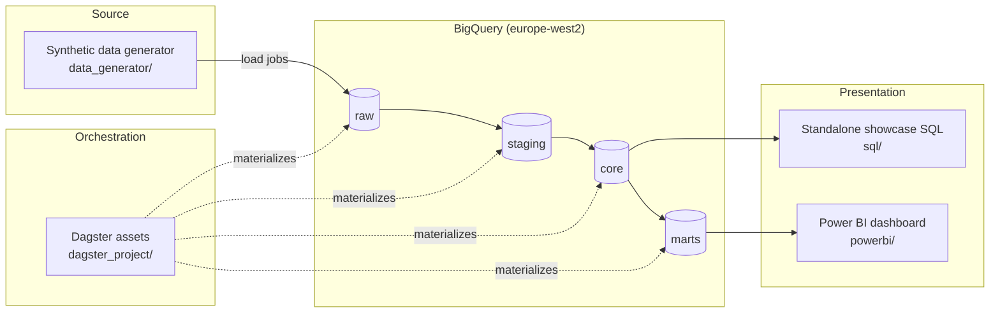

# SaaS Analytics Warehouse

A BigQuery + Dagster + Power BI analytics warehouse for a synthetic B2B SaaS business, built to find and quantify preventable revenue loss from customer churn.

## The business problem

A B2B SaaS company can't currently tell which accounts are about to cancel, or correctly consolidate MRR across enterprise customers with nested subsidiary accounts. This project builds the warehouse and analysis to:

1. **Flag at-risk accounts before they cancel**, using usage-decline and billing-health signals.
2. **Consolidate MRR correctly** across arbitrary-depth parent/child account hierarchies (enterprise umbrella accounts with regional subsidiaries, some nested 3 levels deep).
3. **Quantify the revenue upside** of acting on (1).

### Headline number

As of the latest data, **8 of 212 active accounts (3.8%)** are flagged high-risk, representing **$2,023/month ($24,276/year)** of at-risk recurring revenue against a company-wide **$48,233/month** total MRR. Assuming a conservative **40% success rate** for proactive retention outreach (a commonly-cited figure for this kind of intervention) — a figure chosen deliberately below 100% since not every flagged account can be saved — that's **~$9,710/year in defensible, transparently-computed savings** from acting on this dashboard alone. The math is shown on the dashboard card itself, not hidden behind a single opaque number.

This is computed directly from the (synthetic) warehouse data via `sql/04_churn_risk_scoring_cte_subquery.sql` and `marts.churn_risk_accounts` / `marts.mrr_monthly` — not invented, since the dataset is one I generated and fully control.

## Architecture



Full write-up in [`docs/architecture.md`](docs/architecture.md).

## Warehouse layers

| Layer | Contents |
|---|---|
| `raw` | 5 tables loaded as-is from generated CSVs, messiness intact (duplicates, mixed date formats, currency strings, orphan FKs) |
| `staging` | Cleaned/deduplicated versions of each raw table, plus `rejected_*` quarantine tables for orphaned foreign keys |
| `core` | Dimensional model: `dim_account`, `dim_account_hierarchy` (recursive CTE closure table), `dim_plan`, `dim_date`, `fct_subscription_events`, `fct_invoices`, and the day-partitioned `fct_usage_daily` |
| `marts` | Business-ready aggregates: `mrr_monthly`, `churn_risk_accounts`, `ltv_by_account`, `cohort_retention`, `enterprise_mrr_rollup` |

Full column-level reference in [`docs/data_dictionary.md`](docs/data_dictionary.md).

## Advanced SQL showcase

[`/sql`](sql/README.md) has 6 standalone, business-question-driven queries meant to be read and run directly against the warehouse:

| Query | Technique |
|---|---|
| Recursive enterprise hierarchy rollup | `WITH RECURSIVE`, running-total window function |
| MRR growth (LAG) | `LAST_VALUE(... IGNORE NULLS)` forward-fill, `LAG` |
| Cohort retention curve | `CROSS JOIN` grid, forward-fill window function |
| Churn risk scoring | Chained CTEs, `APPROX_QUANTILES` subquery threshold |
| LTV percentile ranking | `NTILE`, `PERCENT_RANK`, `RANK() PARTITION BY` |
| Running total revenue | `SUM() OVER`, rolling average |

## Dashboard

Power BI project in [`/powerbi`](powerbi/data_model.md) — 4 pages (Overview, Churn Risk, Retention, Enterprise Accounts) against the `marts` dataset via a least-privilege `powerbi-reader` service account. Delivered as a static PDF export (`powerbi/SaaS_Analytics_Dashboard.pdf`); see [`powerbi/published_link.md`](powerbi/published_link.md) for why, and how to re-publish it live.

## Pipeline design notes

- **Sandbox-safe DDL-only writes.** BigQuery's free sandbox forbids DML (`INSERT`/`UPDATE`/`MERGE`); every asset materializes via `CREATE OR REPLACE TABLE ... AS SELECT`. Tables also auto-expire after 60 days idle — expected if you clone this repo and don't run the pipeline; re-running `dagster asset materialize` rebuilds everything from scratch.
- **Partitioned writes needed a real billing account.** The sandbox silently drops every row written to a genuinely `PARTITION BY`-partitioned table (confirmed across CTAS, destination-write, and load-job paths). Fixed by linking billing — the project (`europe-west2`, a UK region) now has billing enabled but stays within free-tier usage.
- **Backfills are idempotent and resumable.** `fct_usage_daily` rebuilds one day at a time (`CREATE OR REPLACE TABLE ... AS SELECT * FROM self WHERE date != target UNION ALL <fresh day>`), so a backfill can be interrupted (a BigQuery partition-modification quota was hit mid-backfill) and resumed without redoing completed days. Details and the quota story: [`docs/backfill_demo.md`](docs/backfill_demo.md).
- **Injected data messiness has a named fix per issue** — duplicate rows, mixed date formats, currency-formatted strings, orphaned foreign keys, plan-name string variants, blank-vs-null inconsistency. See the data dictionary for the staging-layer fix for each.

## Running it yourself

```bash
# 1. Generate synthetic source data
python data_generator/generate_synthetic_data.py

# 2. Configure credentials
cp .env.example .env   # fill in GCP_PROJECT_ID, GCP_SERVICE_ACCOUNT_KEY_PATH, BQ_LOCATION

# 3. Materialize the full pipeline
cd dagster_project
export PYTHONPATH="$(pwd)"
dagster asset materialize --select "raw,staging,core,marts" -m saas_pipeline.definitions

# or launch the Dagster UI for an interactive/backfill view
dagster dev -m saas_pipeline.definitions
```

Requires a BigQuery project (sandbox tier works, except for partitioned-table writes — see above) and a service account key with `bigquery.dataEditor` + `bigquery.jobUser`. Power BI setup: [`powerbi/data_model.md`](powerbi/data_model.md).

## Stack

BigQuery · Dagster · Python (synthetic data generation) · Power BI Desktop/Service
