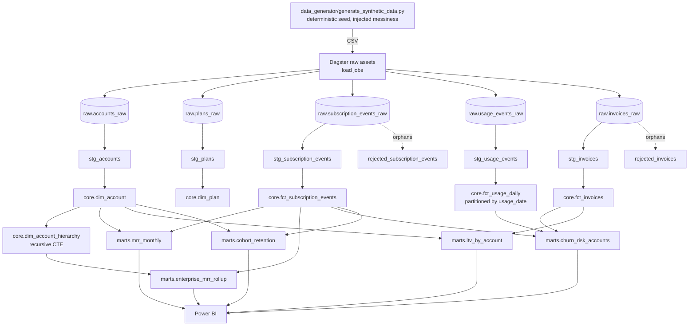

# Architecture

## Overview

## Layer responsibilities

**raw** — one table per source entity, loaded byte-for-byte via Dagster load-job assets (`assets/raw.py`). Deliberately messy: duplicate rows, mixed date formats, currency-formatted strings, orphaned foreign keys, blank-vs-null inconsistency, plan-name string variants. Nothing is cleaned here — this layer exists to prove the staging layer's fixes are real, not assumed away by clean synthetic data.

**staging** — one `stg_*` table per raw table (`assets/staging.py`, SQL in `sql/staging/`), full-refresh `CREATE OR REPLACE TABLE ... AS SELECT`. Each cleaning rule is named and reversible: `QUALIFY ROW_NUMBER() ... = 1` for dedup, a `COALESCE(SAFE.PARSE_DATE(...), ...)` chain for mixed date formats, `SAFE_CAST(REGEXP_REPLACE(x, r'[$,]', '') AS NUMERIC)` for currency strings, `NULLIF(TRIM(col), '')` for blank/null inconsistency. Rows with orphaned foreign keys are routed to `rejected_subscription_events` / `rejected_invoices` quarantine tables rather than silently dropped.

**core** — the dimensional model (`assets/core.py`, `assets/core_partitioned.py`). `dim_account_hierarchy` is the one genuinely recursive structure in the warehouse: a `WITH RECURSIVE` CTE resolves each account's root umbrella account and depth, with a `WHERE depth < 10` cycle guard. `fct_usage_daily` is the one partitioned fact table (`DailyPartitionsDefinition`, one partition per calendar day), aggregated up from the hourly-grain `stg_usage_events` — roughly a 6x row-count reduction (310k hourly events -> 53k daily rows) while preserving everything the marts need.

**marts** — business-ready aggregates (`assets/marts.py`, SQL in `sql/marts/`), each answering one specific question: month-over-month MRR trend, which accounts are at churn risk, lifetime value ranking, cohort retention curves, and enterprise MRR rollups. These are exactly the 5 tables Power BI connects to — nothing upstream of `marts` is exposed to the dashboard (enforced via the `powerbi-reader` service account's dataset-level IAM, not just convention).

## Orchestration (Dagster)

- `dagster_project/saas_pipeline/definitions.py` wires all 5 asset groups (`raw_assets`, `staging_assets`, `core_assets`, `core_partitioned_assets`, `marts_assets`) into one `Definitions` object, in dependency order.
- `resources.py` configures a single `BigQueryResource`, credentialed via `GOOGLE_APPLICATION_CREDENTIALS` (env-driven, no secrets committed).
- `partitions.py` defines `daily_partitions = DailyPartitionsDefinition(start_date="2024-01-01")`, used only by `fct_usage_daily`.
- Every asset in every layer follows the same `_make_X_asset(table_name, deps)` factory pattern — one SQL file per table, executed via a shared `run_sql_file()` helper (`sql_utils.py`). Adding a new table is: write the SQL, register one factory call, done.

## Platform constraints this design works around

1. **No DML in the sandbox tier.** Every write is `CREATE OR REPLACE TABLE ... AS SELECT` or a destination-table query/load job — never `INSERT`/`UPDATE`/`MERGE`.
2. **Sandbox silently no-ops writes to `PARTITION BY` tables.** Confirmed by testing CTAS, destination-write, and load-job paths — all reported success with 0 rows written. Fixed by linking a billing account (the project stays within free-tier usage day-to-day; billing is required to unlock the partitioned-write API path, not because the workload costs money).
3. **BigQuery partition-modification quota.** A backfill of `fct_usage_daily`'s full history hit a real, tightly-scoped quota on partition rewrites. The fix is architectural, not a workaround: because each partition rebuild is already idempotent (`CREATE OR REPLACE TABLE ... AS SELECT * FROM self WHERE date != target UNION ALL <fresh day>`), a backfill can stop cleanly on `403 Forbidden` and resume later, skipping whatever's already materialized. See [`backfill_demo.md`](backfill_demo.md).
